## Introduction
This is a microservices project. Using:
1. [Spring Cloud](https://spring.io/projects/spring-cloud).
2. [PostgreSQL](https://hub.docker.com/layers/library/postgres/alpine3.19/images/sha256-33ae62f11f31af2f2c29f02d1c3bea0727287794ec4323632bdd559256f7ed00) as the database
3. [Eureka](https://spring.io/guides/gs/service-registration-and-discovery/) and [OpenFeign](https://spring.io/projects/spring-cloud-openfeign) for service discovery and load balancing
4. [Spring Cloud Sleuth](https://spring.io/projects/spring-cloud-sleuth) and [Zipkin](https://zipkin.io/) for distribute tracing
5. [RabbitMQ](https://www.rabbitmq.com/) for the implementation of AMQP
6. [Spring Cloud Gateway](https://spring.io/projects/spring-cloud-gateway) for API Gateway


Services dependency overview (Zipkin dashboard):
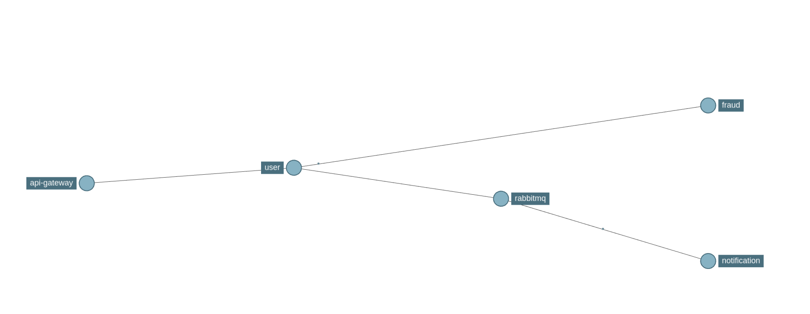


## Quick Start

### Clone the Project

```bash
git clone https://github.com/JeremiahXing/th-services.git
```
```bash
cd ./th-services
```

All the service modules you need are dockerized and pushed on dockerhub, so you can quickly run it via docker compose.
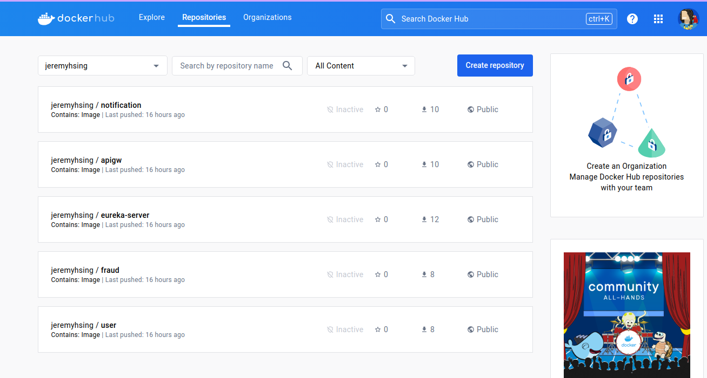

Run following command under the project root folder to auto pull images as needed and run docker containers.
```bash
docker compose up -d
```
> **_NOTE:_**  If you are first time running those docker containers. 
> The `user`, `fraud`, and `notification` containers might fail. 
> If you inspect the logs by `docker logs user`, you can find error logs about cannot find database.
> Don't be worry. You just need set up those databases as following:

### Initial database setup:

This project use [PgAdmin](https://www.pgadmin.org/) for managing postgreSQL database.
Please make sure the `postgres` and `pgadmin` containers are still running. Then open http://localhost:5050/ in your browser.
1. Set up a master password if it prompts to do so
2. Connect or register a server (the server name doesn't matter)

   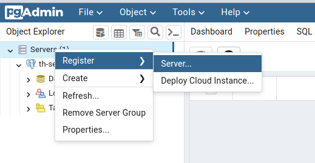

   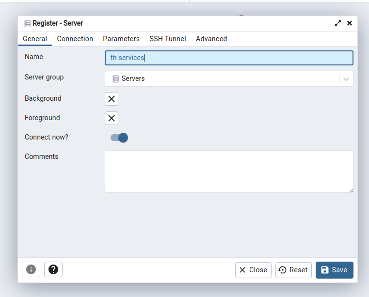
   1. The host name should be `postgres` as the postgres docker container's name; 
   2. the Username should be `jezhsing` and the password is `password`.
   
   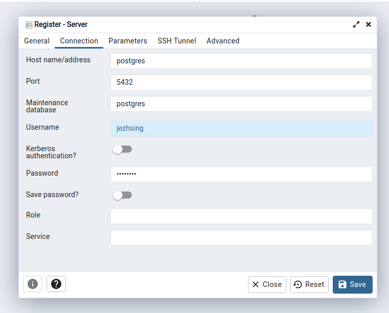
3. Please create according databases (th-user, th-fraud, th-notification)

   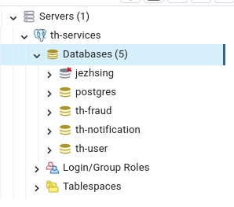

Now the database should be all set, run `docker compose up -d` again to start all services.

## Minoring Dashboards

1. Database Management: PgAdmin http://localhost:5050/

   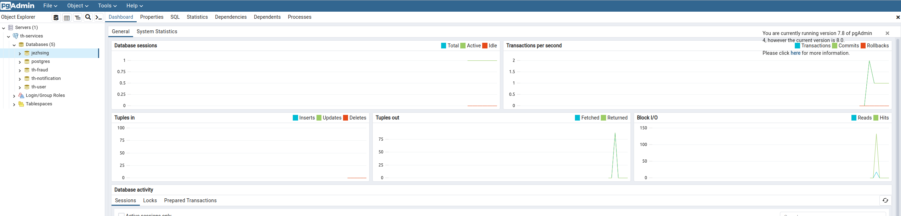

2. Services Discovery: Eureka http://localhost:8761/

   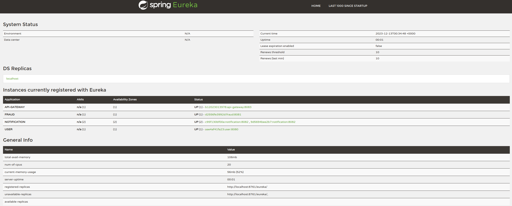

3. Distribute Tracing: Zipkin http://localhost:9411/

   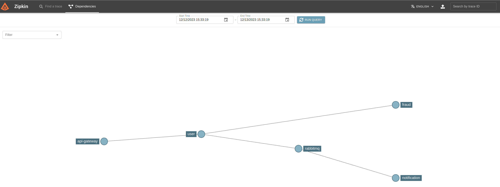

   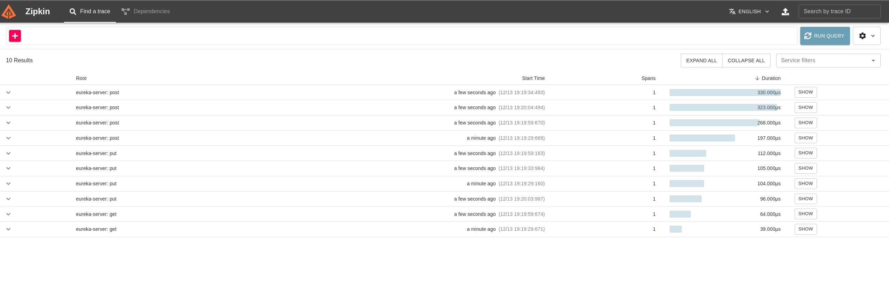

4. Message Queue: RabbitMQ http://localhost:15672/ (username&password: guest)

   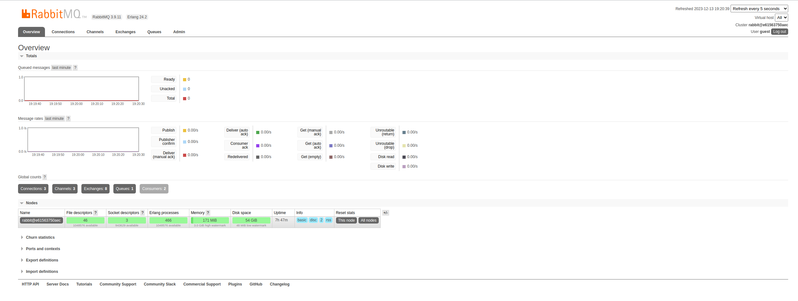


## Test

Using Postman:

1.  
   1. endpoint: localhost:8083/api/v1/user/create
   2. HTTP Request: POST
   3. payload: 
   ```json
   {
    "firstName": "Micheal",
    "lastName": "LastName",
    "email": "example@email.com"
    }
   ```

2.
    1. endpoint: localhost:8083/api/v1/user/{userId}
    2. HTTP Request: GET

3.
    1. endpoint: localhost:8083/api/v1/user/all
    2. HTTP Request: GET
